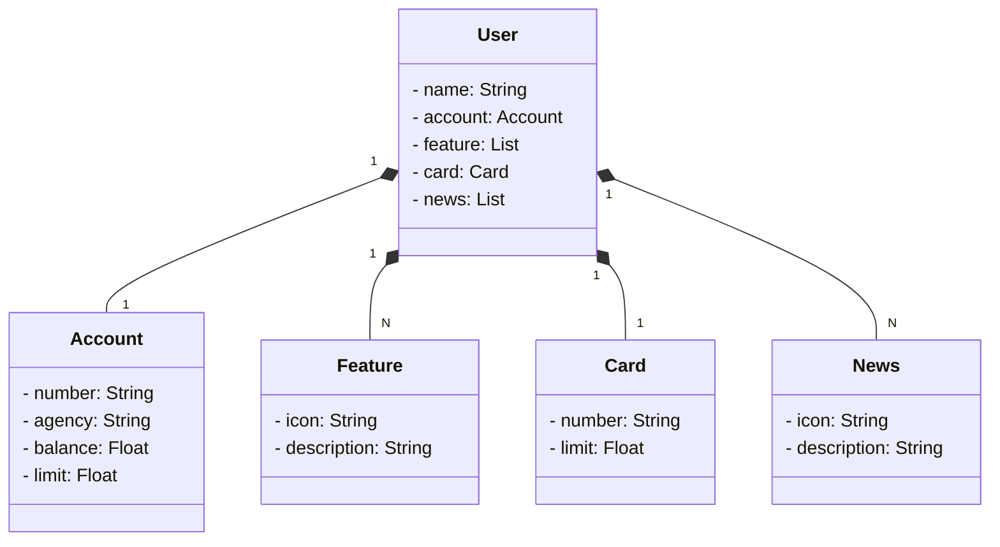

# Santander Dev Week 2023 
Java RESTful API criada para o Santander Dev Week.

## Principais Tecnologias

Neste projeto, fazemos uso de uma variedade de tecnologias modernas para fornecer uma experiência de desenvolvimento robusta e eficiente. Abaixo estão algumas das principais tecnologias que utilizamos:

- **Java 17:** Estamos aproveitando a versão mais recente do Java, que é a versão LTS, para tirar vantagem das últimas inovações que essa linguagem amplamente utilizada oferece.

- **Spring Boot 3:** Trabalhamos com a versão mais recente do Spring Boot, que maximiza a produtividade do desenvolvedor por meio de sua poderosa premissa de autoconfiguração. Isso nos permite criar aplicativos de forma rápida e eficiente.

- **Spring Data JPA:** Exploramos o uso do Spring Data JPA para simplificar nossa camada de acesso aos dados. Isso facilita a integração com bancos de dados SQL e nos permite escrever consultas de forma mais eficiente.

- **OpenAPI (Swagger):** Criamos uma documentação de API eficaz e fácil de entender usando a OpenAPI (Swagger). Essa documentação está perfeitamente alinhada com a alta produtividade que o Spring Boot oferece, tornando mais fácil para os desenvolvedores entenderem e usarem nossos endpoints de API.

- **Railway:** Para o deploy e monitoramento de nossas soluções na nuvem, utilizamos o Railway. Além disso, aproveitamos os serviços de banco de dados oferecidos por ele e implementamos pipelines de CI/CD para garantir uma entrega contínua de alta qualidade.

Estas tecnologias combinadas nos permitem criar aplicações modernas e eficientes, garantindo um desenvolvimento suave e uma experiência excepcional para nossos usuários.

## Diagrama de classes

